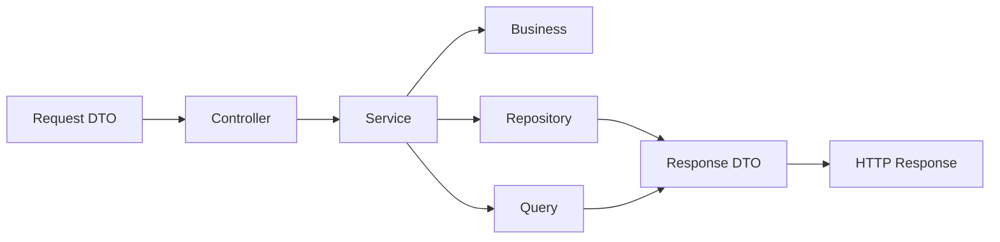

<p align="center">
  
</p>

<h1 align="center">M3L for Node.js</h1>

<p align="center">
  <a href="./README.md">Language Portal</a> •
  <a href="./README.pt-BR.md">Português (BR)</a>
</p>

Implementation of the **M3L — Modular in 3 Layers** pattern for **Node.js + TypeScript** backend applications.

M3L organizes the application by **business modules**, and each module is divided into **three main layers**: `http`, `domain`, and `infrastructure`. Its goal is to build clearer, more cohesive, predictable, and sustainable backends by using Node.js with architectural discipline.

---

## Table of Contents

- [Overview](#overview)
- [Core Principle](#core-principle)
- [Base Structure](#base-structure)
- [Architectural Flow](#architectural-flow)
- [Layer Responsibilities](#layer-responsibilities)
- [Practical Example](#practical-example)
- [Cross-Module Queries](#cross-module-queries)
- [Mandatory Conventions](#mandatory-conventions)
- [Mental Checklist](#mental-checklist)
- [What Is Allowed / What Should Not Be the Default](#what-is-allowed--what-should-not-be-the-default)
- [Controlled Extensibility](#controlled-extensibility)
- [Repository Purpose](#repository-purpose)
- [License](#license)

---

## Overview

M3L is not just a way to organize directories. It defines a disciplined way to use Node.js and TypeScript without letting the ecosystem’s freedom dilute architectural clarity.

In this pattern, the project is organized by **functional contexts**, not by global technical dumping grounds such as `controllers`, `services`, `repositories`, and `types` spread across the application root.

> The logic is simple: the module is the main organizational unit; layers exist inside it to separate responsibilities.

In the Node.js ecosystem, this means keeping architecture above the HTTP framework, ORM, and database driver. M3L does not depend on Express, Fastify, Prisma, Knex, or TypeORM to exist. These choices enter as technical materialization, not as the center of the design.

---

## Core Principle

> **Module first, layer after.**

The M3L architectural flow can be summarized like this:

- **Controllers receive**
- **Services orchestrate**
- **Business decides**
- **Repositories persist**
- **Queries read and compose data**

This principle reduces coupling, improves readability, and makes it harder for the project to turn into a pile of “ownerless” files.

---

## Base Structure

```txt
src/
  modules/
    companies/
      http/
        controllers/
        requests/
        responses/
      domain/
        services/
        business/
        enums/
      infrastructure/
        repositories/
        queries/
```

Each module concentrates its HTTP entrypoint, orchestration, business rules, canonical persistence, and read queries.

### Quick Reading of the Structure

| Layer | Role |
|---|---|
| `http` | Application input and output |
| `domain` | Orchestration and business rules |
| `infrastructure` | Persistence and queries |

### Important Note on Node.js Materialization

In the Node.js ecosystem, a module’s canonical persistence is usually materialized through **`repositories`** and the technical artifacts adopted by the data stack, such as drivers, ORMs, query builders, or specific clients.

HTTP output is usually represented by **response DTOs** or **response mappers**, organized under `http/responses`.

The architectural principle remains the same; what changes is only how each responsibility is materialized within the stack.

---

## Architectural Flow



### Flow Summary

**Request DTO -> Controller -> Service -> Business -> Repository / Query -> Response DTO**

- **Request DTO** validates and normalizes input
- **Controller** receives and delegates
- **Service** orchestrates the use case
- **Business** concentrates pure rules
- **Repository** sustains the module’s canonical persistence
- **Query** resolves reads, filters, projections, and cross-data composition
- **Response DTO** transforms HTTP output

---

## Layer Responsibilities

### Http

Responsible for application input and output.

| Element | Responsibility | Can use | Should not do |
|---|---|---|---|
| `controllers` | Receive the request and delegate the use case | HTTP framework, `Request`, `Response`, dependency injection | Business rules, complex queries, direct database writes |
| `requests` | Validate, parse, and normalize HTTP input | schemas, parse functions, types, validation | Business rules, persistence, heavy queries |
| `responses` | Represent HTTP output | DTOs, response mappers, serialization | Query the database, define rules, mutate state |

### Domain

Responsible for orchestration and business rules.

| Element | Responsibility | Can use | Should not do |
|---|---|---|---|
| `services` | Orchestrate the use case | `business`, `repositories`, `queries`, transactions | Turn into a giant file containing all system rules |
| `business` | Concentrate pure domain rules | Pure TypeScript, enums, functions, small objects | Know `repository`, `query`, `controller`, or another `business` |
| `enums` | Represent controlled states | `enum` or union types | Spread magic strings throughout the system |

### Infrastructure

Responsible for persistence and queries.

| Element | Responsibility | Can use | Should not do |
|---|---|---|---|
| `repositories` | Sustain the module’s canonical persistence | ORM, query builder, SQL/NoSQL driver, mapper | Turn into use-case orchestrators or rule engines |
| `queries` | Resolve reads, filters, projections, reports, and joins | SQL, query builders, clients, projections | Transactional writes and business rule decisions |

---

## Practical Example

### `companies` Module Structure

```txt
src/modules/companies/
  http/
    controllers/
      CompanySaveController.ts
    requests/
      CompanySaveRequest.ts
    responses/
      CompanyResponse.ts
  domain/
    services/
      CompanySaveService.ts
    business/
      CompanyValidationBusiness.ts
    enums/
      CompanyStatus.ts
  infrastructure/
    repositories/
      CompanyRepository.ts
      InMemoryCompanyRepository.ts
    queries/
      CompanyListQuery.ts
```

### Complete Module Example

<details>
<summary><strong>CompanySaveController.ts</strong></summary>

```ts
// src/modules/companies/http/controllers/CompanySaveController.ts

import type { Request, Response, NextFunction } from 'express';
import { CompanySaveService } from '../../domain/services/CompanySaveService';
import { CompanySaveRequest } from '../requests/CompanySaveRequest';
import { CompanyResponse } from '../responses/CompanyResponse';

export class CompanySaveController {
  constructor(
    private readonly service: CompanySaveService,
  ) {}

  async handle(req: Request, res: Response, next: NextFunction): Promise<void> {
    try {
      const input = CompanySaveRequest.parse(req.body);
      const company = await this.service.handle(input);

      res.status(201).json(CompanyResponse.from(company));
    } catch (error) {
      next(error);
    }
  }
}
```

</details>

<details>
<summary><strong>CompanySaveRequest.ts</strong></summary>

```ts
// src/modules/companies/http/requests/CompanySaveRequest.ts

export type CompanySaveInput = {
  name: string;
  document: string;
  type: string;
};

export class CompanySaveRequest {
  static parse(input: unknown): CompanySaveInput {
    const data = input as Record<string, unknown>;

    if (typeof data?.name !== 'string' || data.name.trim() === '') {
      throw new Error('Company name is required.');
    }

    if (typeof data?.document !== 'string' || data.document.trim() === '') {
      throw new Error('Company document is required.');
    }

    if (typeof data?.type !== 'string' || data.type.trim() === '') {
      throw new Error('Company type is required.');
    }

    return {
      name: data.name.trim(),
      document: data.document.trim(),
      type: data.type.trim(),
    };
  }
}
```

</details>

<details>
<summary><strong>CompanyResponse.ts</strong></summary>

```ts
// src/modules/companies/http/responses/CompanyResponse.ts

type CompanyDto = {
  id: string;
  name: string;
  document: string;
  type: string;
  status: string;
};

export class CompanyResponse {
  static from(company: CompanyDto) {
    return {
      id: company.id,
      name: company.name,
      document: company.document,
      type: company.type,
      status: company.status,
    };
  }
}
```

</details>

<details>
<summary><strong>CompanyStatus.ts</strong></summary>

```ts
// src/modules/companies/domain/enums/CompanyStatus.ts

export enum CompanyStatus {
  PENDING = 'pending',
  APPROVED = 'approved',
  REJECTED = 'rejected',
}
```

</details>

<details>
<summary><strong>CompanySaveService.ts</strong></summary>

```ts
// src/modules/companies/domain/services/CompanySaveService.ts

import { CompanyValidationBusiness } from '../business/CompanyValidationBusiness';
import { CompanyStatus } from '../enums/CompanyStatus';
import { CompanyRepository } from '../../infrastructure/repositories/CompanyRepository';
import { CompanySaveInput } from '../../http/requests/CompanySaveRequest';

export class CompanySaveService {
  constructor(
    private readonly validationBusiness: CompanyValidationBusiness,
    private readonly companyRepository: CompanyRepository,
  ) {}

  async handle(data: CompanySaveInput) {
    this.validationBusiness.validateForSave(data.document, data.type);

    return this.companyRepository.save({
      name: data.name,
      document: data.document,
      type: data.type,
      status: CompanyStatus.PENDING,
    });
  }
}
```

</details>

<details>
<summary><strong>CompanyValidationBusiness.ts</strong></summary>

```ts
// src/modules/companies/domain/business/CompanyValidationBusiness.ts

export class CompanyValidationBusiness {
  validateForSave(document: string, type: string): void {
    if (document.trim() === '') {
      throw new Error('Company document is required.');
    }

    if (!['generator', 'operator', 'manager', 'manufacturer'].includes(type)) {
      throw new Error('Invalid company type.');
    }
  }
}
```

</details>

<details>
<summary><strong>CompanyRepository.ts</strong></summary>

```ts
// src/modules/companies/infrastructure/repositories/CompanyRepository.ts

import { CompanyStatus } from '../../domain/enums/CompanyStatus';

export type CompanyRecord = {
  id: string;
  name: string;
  document: string;
  type: string;
  status: CompanyStatus;
};

export interface CompanyRepository {
  save(data: Omit<CompanyRecord, 'id'>): Promise<CompanyRecord>;
}
```

</details>

<details>
<summary><strong>InMemoryCompanyRepository.ts</strong></summary>

```ts
// src/modules/companies/infrastructure/repositories/InMemoryCompanyRepository.ts

import { randomUUID } from 'node:crypto';
import { CompanyRecord, CompanyRepository } from './CompanyRepository';

export class InMemoryCompanyRepository implements CompanyRepository {
  private readonly items: CompanyRecord[] = [];

  async save(data: Omit<CompanyRecord, 'id'>): Promise<CompanyRecord> {
    const company: CompanyRecord = {
      id: randomUUID(),
      ...data,
    };

    this.items.push(company);

    return company;
  }
}
```

</details>

<details>
<summary><strong>CompanyListQuery.ts</strong></summary>

```ts
// src/modules/companies/infrastructure/queries/CompanyListQuery.ts

export type CompanyListFilters = {
  status?: string;
  name?: string;
};

export type CompanyListItem = {
  id: string;
  name: string;
  document: string;
  type: string;
  status: string;
};

export class CompanyListQuery {
  constructor(
    private readonly db: {
      query<T>(sql: string, params?: unknown[]): Promise<T[]>;
    },
  ) {}

  async handle(filters: CompanyListFilters = {}): Promise<CompanyListItem[]> {
    const conditions: string[] = [];
    const params: unknown[] = [];

    if (filters.status) {
      params.push(filters.status);
      conditions.push(`status = $${params.length}`);
    }

    if (filters.name) {
      params.push(`%${filters.name}%`);
      conditions.push(`name ILIKE $${params.length}`);
    }

    const where = conditions.length > 0
      ? `WHERE ${conditions.join(' AND ')}`
      : '';

    return this.db.query<CompanyListItem>(
      `
        SELECT id, name, document, type, status
        FROM companies
        ${where}
        ORDER BY name ASC
      `,
      params,
    );
  }
}
```

</details>

The examples above reflect the recommended use of the pattern in Node.js with TypeScript: thin controller, action-oriented service, pure business logic, repository dedicated to persistence, and query focused on reading.

---

## Cross-Module Queries

In M3L, cross-module reads should be resolved through `queries`, not through structural coupling between persistence components as the main strategy.

The module remains the owner of its canonical persistence; cross-module reading happens in a dedicated query.

Example:

```ts
// src/modules/companies/infrastructure/queries/DocumentWithCompanyListQuery.ts

export class DocumentWithCompanyListQuery {
  constructor(
    private readonly db: {
      query<T>(sql: string, params?: unknown[]): Promise<T[]>;
    },
  ) {}

  async handle(filters: { status?: string } = {}) {
    const params: unknown[] = [];
    const conditions: string[] = [];

    if (filters.status) {
      params.push(filters.status);
      conditions.push(`d.status = $${params.length}`);
    }

    const where = conditions.length > 0
      ? `WHERE ${conditions.join(' AND ')}`
      : '';

    return this.db.query(
      `
        SELECT
          d.id,
          d.type,
          d.number,
          d.status,
          c.id   AS company_id,
          c.name AS company_name
        FROM documents d
        INNER JOIN companies c ON c.id = d.company_id
        ${where}
        ORDER BY d.id DESC
      `,
      params,
    );
  }
}
```

---

## Mandatory Conventions

- **Controllers**: action-oriented and responsible only for receiving and delegating
- **Services**: a single public method called `handle()`
- **Business**: must not know `repository`, `query`, `controller`, or another `business`
- **Repositories**: the module’s canonical persistence
- **Queries**: reads, filters, reports, and cross-data queries

---

## Mental Checklist

- Is this HTTP input? Then it goes in `http`
- Does this orchestrate a use case? Then it goes in `domain/services`
- Is this a pure business rule? Then it goes in `domain/business`
- Does this represent a controlled state? Then it goes in `domain/enums`
- Does this persist the module canonically? Then it goes in `infrastructure/repositories`
- Is this a read, filter, report, or join? Then it goes in `infrastructure/queries`

---

## What Is Allowed / What Should Not Be the Default

### Allowed

- Service calling `business`, `repository`, and `query`
- Request validating, parsing, and normalizing the payload
- Response representing HTTP output
- Query performing joins, filters, and reports
- Enum or union type representing status, type, and category

### Should Not Be the Default

- Controller accessing the database directly
- Business knowing infrastructure details
- Repository turning into a use-case orchestrator
- Query deciding business rules
- Service turning into a giant file with everything inside it

---

## Controlled Extensibility

M3L allows additional subdirectories inside layers when there is a real and justifiable technical need, such as:

- `types`
- `contracts`
- `mappers`
- `validators`
- `integrations`

These directories must not become a generic folder for code “without a place.” They should exist to solve clear and recurring responsibilities.

When a module depends on external services specific to its own context, the integration should remain inside the module itself, in `infrastructure/integrations`.

Example:

```txt
src/modules/documents/infrastructure/integrations/
  AzureDocumentIntelligenceClient.ts
  OpenAiDocumentAnalysisClient.ts
```

This kind of organization avoids premature granularity and keeps the integration close to the domain that uses it.

---

## Repository Purpose

This repository exists to document and exemplify the application of the M3L pattern in the Node.js + TypeScript ecosystem, serving as a reference for:

- new project architecture
- team standardization
- technical onboarding
- code review
- building modular and sustainable backends

---

## License

This documentation is licensed under the
[Creative Commons Attribution 4.0 International License (CC BY 4.0)](https://creativecommons.org/licenses/by/4.0/).
