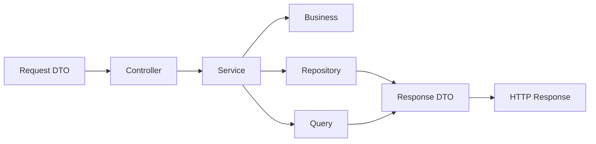

# M3L for Node.js

Implementação do padrão **M3L — Modular in 3 Layers** para aplicações backend com **Node.js + TypeScript**.

O M3L organiza a aplicação por **módulos de negócio**, e cada módulo é dividido em **três camadas principais**: `http`, `domain` e `infrastructure`. O objetivo é construir backends mais claros, coesos, previsíveis e sustentáveis, usando Node.js com disciplina arquitetural.

---

## Sumário

- [Visão geral](#visão-geral)
- [Princípio central](#princípio-central)
- [Estrutura base](#estrutura-base)
- [Fluxo arquitetural](#fluxo-arquitetural)
- [Responsabilidades por camada](#responsabilidades-por-camada)
- [Exemplo prático](#exemplo-prático)
- [Consultas cross-module](#consultas-cross-module)
- [Convenções obrigatórias](#convenções-obrigatórias)
- [Checklist mental](#checklist-mental)
- [Pode / não deve ser padrão](#pode--não-deve-ser-padrão)
- [Extensibilidade controlada](#extensibilidade-controlada)
- [Objetivo deste repositório](#objetivo-deste-repositório)
- [Licença](#licença)

---

## Visão geral

O M3L não é apenas uma forma de organizar diretórios. Ele define um modo disciplinado de usar Node.js e TypeScript sem deixar que a liberdade do ecossistema dilua a clareza da arquitetura.

Neste padrão, o projeto é organizado por **contextos funcionais**, e não por depósitos técnicos globais como `controllers`, `services`, `repositories` e `types` espalhados na raiz da aplicação.

> A lógica é simples: o módulo é a unidade principal de organização; as camadas existem dentro dele para separar responsabilidades.

No ecossistema Node.js, isso significa manter a arquitetura acima do framework HTTP, do ORM e do driver de banco. O M3L não depende de Express, Fastify, Prisma, Knex ou TypeORM para existir. Essas escolhas entram como materialização técnica, não como centro do desenho.

---

## Princípio central

> **Módulo primeiro, camada depois.**

O fluxo arquitetural do M3L pode ser resumido assim:

- **Controllers recebem**
- **Services orquestram**
- **Business decide**
- **Repositories persistem**
- **Queries leem e cruzam dados**

Esse princípio reduz acoplamento, melhora a leitura do código e dificulta que o projeto se transforme em um amontoado de arquivos “sem dono”.

---

## Estrutura base

```txt
src/
  modules/
    companies/
      http/
        controllers/
        requests/
        responses/
      domain/
        services/
        business/
        enums/
      infrastructure/
        repositories/
        queries/
```

Cada módulo concentra sua entrada HTTP, sua orquestração, sua regra de negócio, sua persistência canônica e suas consultas de leitura.

### Leitura rápida da estrutura

| Camada | Papel |
|---|---|
| `http` | Entrada e saída da aplicação |
| `domain` | Orquestração e regra de negócio |
| `infrastructure` | Persistência e consultas |

### Observação importante sobre a materialização no Node.js

No ecossistema Node.js, a persistência canônica do módulo costuma se materializar por meio de **`repositories`** e dos artefatos técnicos adotados pela stack de dados, como drivers, ORMs, query builders ou clientes específicos.

Já a saída HTTP costuma ser representada por **response DTOs** ou **mapeadores de resposta**, organizados em `http/responses`.

O princípio arquitetural permanece o mesmo: o que muda é apenas a forma como cada responsabilidade se concretiza dentro da stack.

---

## Fluxo arquitetural



### Resumo do fluxo

**Request DTO -> Controller -> Service -> Business -> Repository / Query -> Response DTO**

- **Request DTO** valida e normaliza a entrada
- **Controller** recebe e delega
- **Service** orquestra o caso de uso
- **Business** concentra regra pura
- **Repository** sustenta a persistência canônica do módulo
- **Query** resolve leitura, filtros, projeções e cruzamentos
- **Response DTO** transforma a saída HTTP

---

## Responsabilidades por camada

### Http

Responsável pela entrada e saída da aplicação.

| Elemento | Responsabilidade | Pode usar | Não deve fazer |
|---|---|---|---|
| `controllers` | Receber a requisição e delegar o caso de uso | framework HTTP, `Request`, `Response`, injeção de dependência | Regra de negócio, consulta complexa, escrita direta em banco |
| `requests` | Validar, parsear e normalizar a entrada HTTP | schemas, funções de parse, types, validação | Regra de negócio, persistência, consulta pesada |
| `responses` | Representar a saída HTTP | DTOs, mapeadores de resposta, serialização | Consultar banco, decidir regra, mutar estado |

### Domain

Responsável pela orquestração e pelas regras de negócio.

| Elemento | Responsabilidade | Pode usar | Não deve fazer |
|---|---|---|---|
| `services` | Orquestrar o caso de uso | `business`, `repositories`, `queries`, transação | Virar arquivo gigante com toda a regra do sistema |
| `business` | Concentrar regra pura do domínio | TypeScript puro, enums, funções, pequenos objetos | Conhecer `repository`, `query`, `controller` ou outro `business` |
| `enums` | Representar estados controlados | `enum` ou union types | Espalhar strings mágicas pelo sistema |

### Infrastructure

Responsável pela persistência e pelas consultas.

| Elemento | Responsabilidade | Pode usar | Não deve fazer |
|---|---|---|---|
| `repositories` | Sustentar a persistência canônica do módulo | ORM, query builder, driver SQL/NoSQL, mapper | Virar orquestrador de caso de uso ou motor de regra |
| `queries` | Resolver leitura, filtros, projeções, relatórios e joins | SQL, query builders, clients, projections | Escrita transacional e decisão de regra |

---

## Exemplo prático

### Estrutura do módulo `companies`

```txt
src/modules/companies/
  http/
    controllers/
      CompanySaveController.ts
    requests/
      CompanySaveRequest.ts
    responses/
      CompanyResponse.ts
  domain/
    services/
      CompanySaveService.ts
    business/
      CompanyValidationBusiness.ts
    enums/
      CompanyStatus.ts
  infrastructure/
    repositories/
      CompanyRepository.ts
      InMemoryCompanyRepository.ts
    queries/
      CompanyListQuery.ts
```

### Exemplo completo do módulo

<details>
<summary><strong>CompanyStatus.ts</strong></summary>

```ts
export enum CompanyStatus {
  PENDING = 'pending',
  APPROVED = 'approved',
  REJECTED = 'rejected',
}
```

</details>

<details>
<summary><strong>CompanySaveRequest.ts</strong></summary>

```ts
export type CompanySaveInput = {
  name: string;
  document: string;
  type: string;
};

export class CompanySaveRequest {
  static parse(input: unknown): CompanySaveInput {
    const data = input as Record<string, unknown>;

    if (typeof data?.name !== 'string' || data.name.trim() === '') {
      throw new Error('Company name is required.');
    }

    if (typeof data?.document !== 'string' || data.document.trim() === '') {
      throw new Error('Company document is required.');
    }

    if (typeof data?.type !== 'string' || data.type.trim() === '') {
      throw new Error('Company type is required.');
    }

    return {
      name: data.name.trim(),
      document: data.document.trim(),
      type: data.type.trim(),
    };
  }
}
```

</details>

<details>
<summary><strong>CompanyResponse.ts</strong></summary>

```ts
type CompanyDto = {
  id: string;
  name: string;
  document: string;
  type: string;
  status: string;
};

export class CompanyResponse {
  static from(company: CompanyDto) {
    return {
      id: company.id,
      name: company.name,
      document: company.document,
      type: company.type,
      status: company.status,
    };
  }
}
```

</details>

<details>
<summary><strong>CompanyRepository.ts</strong></summary>

```ts
import { CompanyStatus } from '../../domain/enums/CompanyStatus';

export type CompanyRecord = {
  id: string;
  name: string;
  document: string;
  type: string;
  status: CompanyStatus;
};

export interface CompanyRepository {
  save(data: Omit<CompanyRecord, 'id'>): Promise<CompanyRecord>;
}
```

</details>

<details>
<summary><strong>InMemoryCompanyRepository.ts</strong></summary>

```ts
import { randomUUID } from 'node:crypto';
import { CompanyRecord, CompanyRepository } from './CompanyRepository';

export class InMemoryCompanyRepository implements CompanyRepository {
  private readonly items: CompanyRecord[] = [];

  async save(data: Omit<CompanyRecord, 'id'>): Promise<CompanyRecord> {
    const company: CompanyRecord = {
      id: randomUUID(),
      ...data,
    };

    this.items.push(company);

    return company;
  }
}
```

</details>

<details>
<summary><strong>CompanyValidationBusiness.ts</strong></summary>

```ts
export class CompanyValidationBusiness {
  validateForSave(document: string, type: string): void {
    if (document.trim() === '') {
      throw new Error('Company document is required.');
    }

    if (!['generator', 'operator', 'manager', 'manufacturer'].includes(type)) {
      throw new Error('Invalid company type.');
    }
  }
}
```

</details>

<details>
<summary><strong>CompanySaveService.ts</strong></summary>

```ts
import { CompanyValidationBusiness } from '../business/CompanyValidationBusiness';
import { CompanyStatus } from '../enums/CompanyStatus';
import { CompanyRepository } from '../../infrastructure/repositories/CompanyRepository';
import { CompanySaveInput } from '../../http/requests/CompanySaveRequest';

export class CompanySaveService {
  constructor(
    private readonly validationBusiness: CompanyValidationBusiness,
    private readonly companyRepository: CompanyRepository,
  ) {}

  async handle(data: CompanySaveInput) {
    this.validationBusiness.validateForSave(data.document, data.type);

    return this.companyRepository.save({
      name: data.name,
      document: data.document,
      type: data.type,
      status: CompanyStatus.PENDING,
    });
  }
}
```

</details>

<details>
<summary><strong>CompanySaveController.ts</strong></summary>

```ts
import type { Request, Response, NextFunction } from 'express';
import { CompanySaveService } from '../../domain/services/CompanySaveService';
import { CompanySaveRequest } from '../requests/CompanySaveRequest';
import { CompanyResponse } from '../responses/CompanyResponse';

export class CompanySaveController {
  constructor(
    private readonly service: CompanySaveService,
  ) {}

  async handle(req: Request, res: Response, next: NextFunction): Promise<void> {
    try {
      const input = CompanySaveRequest.parse(req.body);
      const company = await this.service.handle(input);

      res.status(201).json(CompanyResponse.from(company));
    } catch (error) {
      next(error);
    }
  }
}
```

</details>

<details>
<summary><strong>CompanyListQuery.ts</strong></summary>

```ts
export type CompanyListFilters = {
  status?: string;
  name?: string;
};

export type CompanyListItem = {
  id: string;
  name: string;
  document: string;
  type: string;
  status: string;
};

export class CompanyListQuery {
  constructor(
    private readonly db: {
      query<T>(sql: string, params?: unknown[]): Promise<T[]>;
    },
  ) {}

  async handle(filters: CompanyListFilters = {}): Promise<CompanyListItem[]> {
    const conditions: string[] = [];
    const params: unknown[] = [];

    if (filters.status) {
      params.push(filters.status);
      conditions.push(`status = $${params.length}`);
    }

    if (filters.name) {
      params.push(`%${filters.name}%`);
      conditions.push(`name ILIKE $${params.length}`);
    }

    const where = conditions.length > 0
      ? `WHERE ${conditions.join(' AND ')}`
      : '';

    return this.db.query<CompanyListItem>(
      `
        SELECT id, name, document, type, status
        FROM companies
        ${where}
        ORDER BY name ASC
      `,
      params,
    );
  }
}
```

</details>

Os exemplos acima refletem o uso recomendado do padrão no Node.js com TypeScript: controller fino, service orientado a ação, business puro, repository dedicado à persistência e query focada em leitura.

---

## Consultas cross-module

No M3L, leituras cruzadas entre módulos devem ser resolvidas por `queries`, e não por acoplamento estrutural entre componentes de persistência como estratégia principal.

O módulo continua dono da sua persistência canônica; a leitura cruzada acontece em uma consulta dedicada.

Exemplo:

```ts
export class DocumentWithCompanyListQuery {
  constructor(
    private readonly db: {
      query<T>(sql: string, params?: unknown[]): Promise<T[]>;
    },
  ) {}

  async handle(filters: { status?: string } = {}) {
    const params: unknown[] = [];
    const conditions: string[] = [];

    if (filters.status) {
      params.push(filters.status);
      conditions.push(`d.status = $${params.length}`);
    }

    const where = conditions.length > 0
      ? `WHERE ${conditions.join(' AND ')}`
      : '';

    return this.db.query(
      `
        SELECT
          d.id,
          d.type,
          d.number,
          d.status,
          c.id   AS company_id,
          c.name AS company_name
        FROM documents d
        INNER JOIN companies c ON c.id = d.company_id
        ${where}
        ORDER BY d.id DESC
      `,
      params,
    );
  }
}
```

---

## Convenções obrigatórias

- **Controllers**: orientados a uma ação e responsáveis apenas por receber e delegar
- **Services**: um único método público chamado `handle()`
- **Business**: não conhece `repository`, `query`, `controller` ou outro `business`
- **Repositories**: persistência canônica do módulo
- **Queries**: leitura, filtros, relatórios e cruzamentos

---

## Checklist mental

- Isso é entrada HTTP? Vai em `http`
- Isso orquestra um caso de uso? Vai em `domain/services`
- Isso é regra pura? Vai em `domain/business`
- Isso representa estado controlado? Vai em `domain/enums`
- Isso persiste o módulo de forma canônica? Vai em `infrastructure/repositories`
- Isso é leitura, filtro, relatório ou join? Vai em `infrastructure/queries`

---

## Pode / não deve ser padrão

### Pode

- Service chamar `business`, `repository` e `query`
- Request validar, parsear e normalizar o payload
- Response representar a saída HTTP
- Query fazer join, filtro e relatório
- Enum ou union type representar status, tipo e categoria

### Não deve ser padrão

- Controller acessar banco diretamente
- Business conhecer infraestrutura
- Repository virar orquestrador de caso de uso
- Query decidir regra de negócio
- Service virar arquivo gigante com tudo dentro

---

## Extensibilidade controlada

O M3L permite subdiretórios adicionais dentro das camadas quando houver necessidade técnica real e justificável, como:

- `types`
- `contracts`
- `mappers`
- `validators`
- `integrations`

Esses diretórios não devem virar pasta genérica de código “sem lugar”. Devem existir para resolver responsabilidades claras e recorrentes.

Quando um módulo depender de serviços externos específicos do seu próprio contexto, a integração deve permanecer dentro do próprio módulo, em `infrastructure/integrations`.

Exemplo:

```txt
src/modules/documents/infrastructure/integrations/
  AzureDocumentIntelligenceClient.ts
  OpenAiDocumentAnalysisClient.ts
```

Esse tipo de organização evita granularização prematura e mantém a integração próxima do domínio que a utiliza.

---

## Objetivo deste repositório

Este repositório existe para documentar e exemplificar a aplicação do padrão M3L no ecossistema Node.js com TypeScript, servindo como referência para:

- arquitetura de novos projetos
- padronização de times
- onboarding técnico
- revisão de código
- construção de backends modulares e sustentáveis

---

## Licença

Esta documentação está sob a licença
[Creative Commons Attribution 4.0 International License (CC BY 4.0)](https://creativecommons.org/licenses/by/4.0/).
